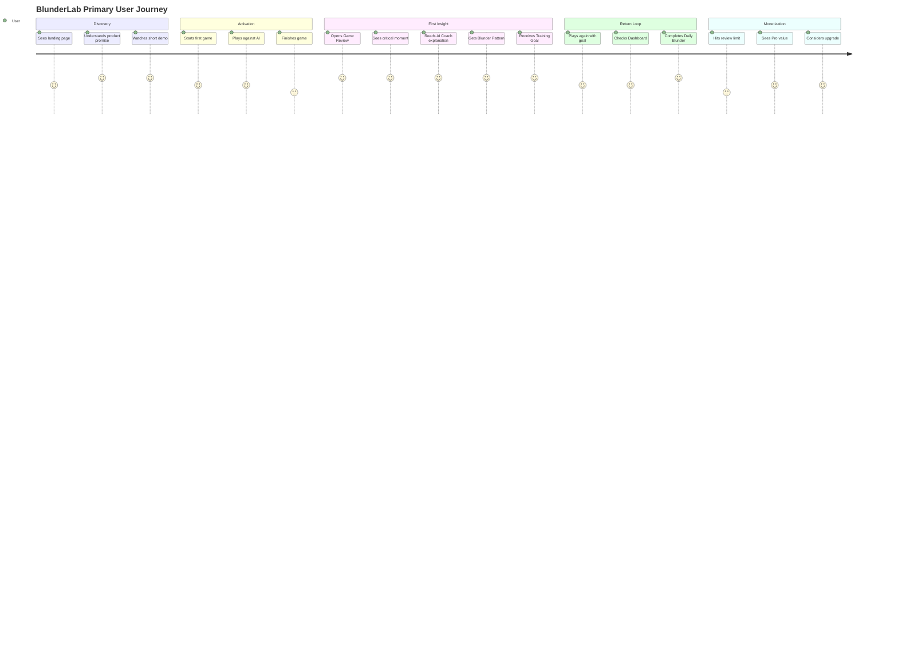
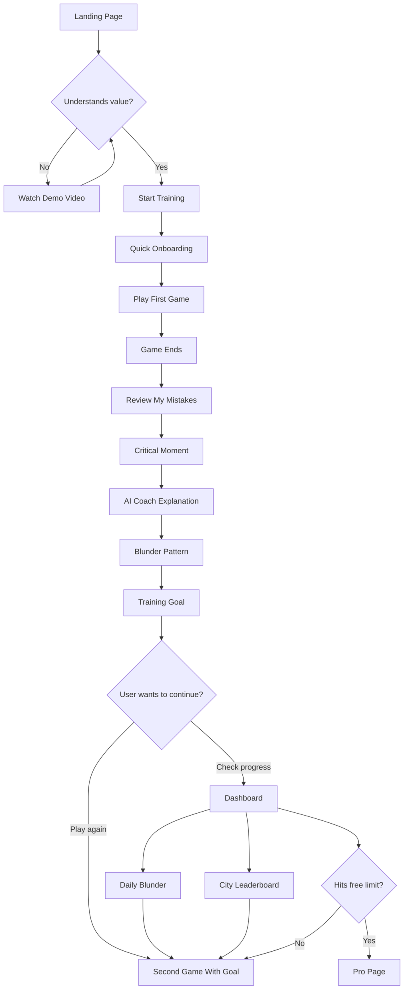
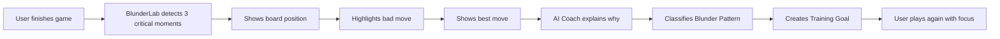
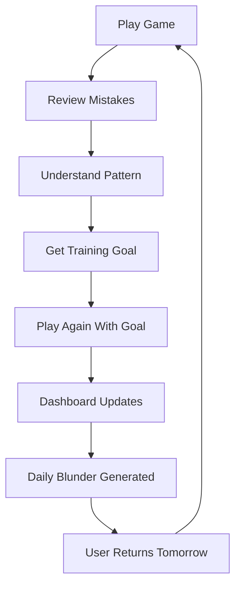
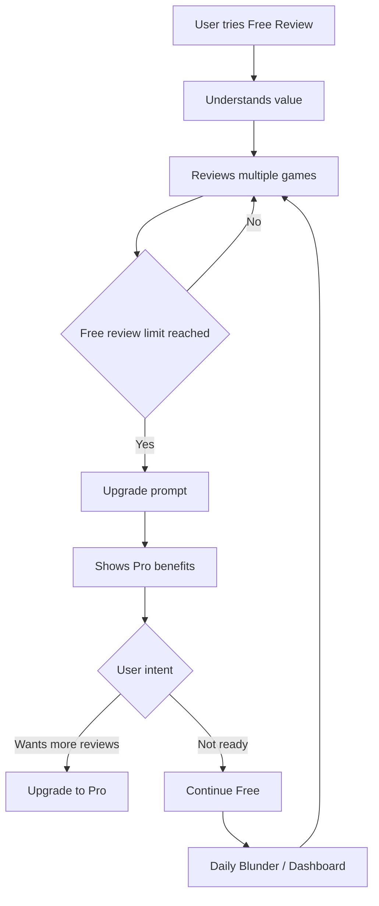

# BlunderLab — Customer Journey Map

Дата: Май 2026
Статус: CJM v1.0
Связанные документы: BlunderLab PRD v1.0, BlunderLab Design Document v2.0
Формат: Markdown + Mermaid diagrams
Цель: описать путь пользователя от первого касания до возвращения в продукт и потенциального Pro upgrade

---

## 1. Цель документа

Customer Journey Map фиксирует, как пользователь проходит через BlunderLab: от первого знакомства с идеей до повторного использования продукта.

Документ нужен не только для UX, но и для product thinking в submission. Он показывает, что BlunderLab проектируется не как набор экранов, а как цельный путь:

> first impression → first game → first mistake → first insight → training goal → return loop → upgrade intent

Главная задача journey:

> довести пользователя до момента, где он не просто увидел ошибку, а понял свой паттерн и захотел сыграть следующую партию осознаннее.

---

## 2. Core Journey Hypothesis

BlunderLab должен выиграть не за счёт того, что пользователь сыграл в шахматы. Это уже умеют делать десятки сервисов.

BlunderLab выигрывает, если пользователь после первой партии думает:

> “Обычно я просто вижу blunder. Здесь я понял, почему я его сделал.”

Поэтому весь journey строится вокруг одного ключевого момента:

# First Insight Moment

Это момент, когда пользователь получает AI Coach explanation + Blunder Pattern + Training Goal.

Если этот момент сработал, пользователь понимает ценность продукта и появляется шанс на удержание.

---

## 3. Primary Persona

### Persona: Motivated Beginner / Student Builder

**Описание:**
Пользователь знает правила шахмат, иногда играет онлайн, но часто проигрывает из-за грубых ошибок. Ему интересно не просто играть, а становиться лучше. Он может быть студентом, junior developer, участником инкубатора или человеком, которому нравится идея шахмат как тренажёра мышления.

**Цель:**
Понять, почему он проигрывает, и получить простой следующий шаг для улучшения.

**Боль:**
Engine analysis кажется сложным, а обычные puzzles не всегда связаны с его реальными ошибками.

**Ключевая потребность:**
Не “покажи лучший ход”, а “объясни, какой паттерн мышления меня подвёл”.

---

## 4. Journey Overview

---

## 5. Journey Stages Table

| Stage              | User Goal                           | User Thought                                  | Product Touchpoint                  | Friction Risk                                | Product Opportunity                                      |
| ------------------ | ----------------------------------- | --------------------------------------------- | ----------------------------------- | -------------------------------------------- | -------------------------------------------------------- |
| 1. Discovery       | Быстро понять, что это за продукт   | “Это просто шахматы или что-то новое?”        | Landing page, hero, demo video      | Слишком generic шахматный лендинг            | Сразу показать AI review и blunder pattern               |
| 2. Interest        | Понять отличие от Chess.com/Lichess | “Почему мне нужен ещё один chess app?”        | How it works, product preview       | Пользователь не видит уникальности           | Объяснить: не play more, understand better               |
| 3. Start           | Быстро попробовать                  | “Надеюсь, не надо долго регистрироваться”     | CTA, guest/demo mode, onboarding    | Длинный signup убьёт интерес                 | Быстрый старт: play first, signup later или 1-click auth |
| 4. First Game      | Сыграть партию без friction         | “Окей, доска должна просто работать”          | Play screen                         | Плохой drag-and-drop, мелкая доска на mobile | Использовать готовую доску, mobile-first layout          |
| 5. Game End        | Понять, что делать дальше           | “Я проиграл. И что теперь?”                   | Review CTA                          | Нет ясного следующего шага                   | Большая кнопка: Review my mistakes                       |
| 6. First Insight   | Понять причину ошибки               | “А, вот почему я проиграл”                    | Game Review, AI Coach, Pattern Card | Слишком много engine lines                   | 3 critical moments, короткое объяснение                  |
| 7. Training Goal   | Получить следующий шаг              | “Что мне теперь тренировать?”                 | Training Goal Card                  | Объяснение без действия                      | 1 конкретная цель на следующую партию                    |
| 8. Return          | Вернуться ради прогресса            | “Хочу проверить, стало ли лучше”              | Dashboard, Daily Blunder, streak    | Нет причины возвращаться                     | Персональная daily-задача из прошлой ошибки              |
| 9. Social Layer    | Сравнить себя без давления          | “Я не топ, но я могу улучшаться”              | City Leaderboard                    | Глобальный рейтинг демотивирует              | Top improvers, review streaks, blunders reduced          |
| 10. Upgrade Intent | Понять, зачем Pro                   | “Что я получу, если буду пользоваться часто?” | Pro page, review limit              | Paywall слишком рано                         | Ограничить free reviews, показать advanced value         |

---

## 6. Detailed Journey

## Stage 1 — Discovery

### Context

Пользователь впервые видит BlunderLab: через submission demo, GitHub README, landing page, social preview или прямую ссылку.

### User goal

Понять за несколько секунд:

* что это;
* чем отличается;
* стоит ли нажимать “Start training”.

### User questions

* “Это просто шахматная доска?”
* “Чем это отличается от Chess.com?”
* “Что здесь AI делает полезного?”
* “Это выглядит как реальный продукт или учебная демка?”

### Product touchpoints

* landing hero;
* embedded demo video;
* product preview;
* headline;
* CTA.

### UX requirement

Первый экран должен показать не только шахматную доску, а весь value loop:

> board + critical moment + AI Coach card + training goal + dashboard preview

### Success signal

Пользователь понимает:

> “Это продукт про то, как понимать свои ошибки после партии.”

---

## Stage 2 — Interest

### Context

Пользователь пролистывает лендинг и пытается понять, почему ему нужен BlunderLab.

### User goal

Убедиться, что продукт не повторяет существующие шахматные сайты.

### User thoughts

* “Я уже могу играть на Lichess.”
* “Chess.com уже показывает blunders.”
* “Что здесь нового?”

### Product response

BlunderLab должен объяснить отличие через simple product statement:

> Engine analysis tells you what was wrong. BlunderLab helps you understand why you repeated it.

### Product touchpoints

* “How it works” section;
* gap explanation;
* sample review card;
* blunder taxonomy preview.

### Success signal

Пользователь понимает:

> “Это не замена Chess.com. Это более сфокусированный AI coach после партии.”

---

## Stage 3 — Start / Onboarding

### Context

Пользователь решил попробовать продукт.

### User goal

Начать игру без лишней настройки.

### User thoughts

* “Только не заставляйте меня заполнять длинную форму.”
* “Я хочу увидеть продукт сразу.”
* “Можно просто сыграть?”

### Product touchpoints

* Start training CTA;
* optional guest mode;
* sign up with Google/email;
* skill level selection;
* city selection.

### Recommended UX

Минимальный onboarding:

1. Start training
2. Choose skill level
3. Choose city
4. Start game

Если нужна регистрация, лучше сделать её максимально лёгкой.

### Friction risk

Длинная регистрация до первого value moment.

### Product opportunity

Можно дать demo mode:

> “Try first review without account.”

Даже если полноценное сохранение требует auth, первый wow moment лучше не откладывать.

---

## Stage 4 — First Game

### Context

Пользователь играет первую партию против AI.

### User goal

Сыграть без технических проблем.

### User thoughts

* “Доска удобная?”
* “Фигуры нормально двигаются?”
* “На телефоне это работает?”
* “AI играет адекватно?”

### Product touchpoints

* Play Screen;
* chessboard;
* game panel;
* move history;
* game status;
* resign/restart.

### UX requirements

* доска должна работать идеально;
* drag-and-drop должен быть smooth;
* правила должны проверяться;
* last move должен быть подсвечен;
* mobile layout должен быть комфортным.

### Success signal

Пользователь не думает о технической реализации. Он просто играет.

---

## Stage 5 — Game End

### Context

Партия закончилась: пользователь проиграл, выиграл или получил draw.

### User goal

Понять, что произошло и что делать дальше.

### User thoughts

* “Где я ошибся?”
* “Это была одна большая ошибка или вся партия была плохой?”
* “Что нажать теперь?”

### Product touchpoints

* game result modal;
* CTA: Review my mistakes;
* short teaser: “We found 3 key moments.”

### UX requirement

После окончания партии продукт не должен оставлять пользователя в пустоте.

Нужен сильный CTA:

> Review my mistakes

Дополнительный microcopy:

> BlunderLab found 3 moments that changed the game.

### Success signal

Пользователь открывает Game Review.

---

## Stage 6 — First Insight Moment

### Context

Пользователь впервые видит Game Review.

Это главный момент всего journey.

### User goal

Понять не просто плохой ход, а причину ошибки.

### User thoughts

* “Вот это мой плохой ход?”
* “Почему он плохой?”
* “Как я должен был думать?”
* “Это реально про мою партию?”

### Product touchpoints

* Game Summary Card;
* Critical Moment Board;
* AI Coach Card;
* Blunder Pattern Card;
* Best Move Card.

### UX requirement

Не перегружать пользователя.

Показываем:

1. 3 critical moments;
2. pattern name;
3. short explanation;
4. best move;
5. why it mattered.

### Emotional goal

Пользователь должен почувствовать:

> “Меня поняли.”

Не просто:

> “Мне показали engine line.”

### Success signal

Пользователь дочитал review и нажал на следующий блок / training goal.

---

## Stage 7 — Training Goal

### Context

Пользователь понял ошибку. Теперь ему нужен следующий шаг.

### User goal

Получить простую цель на следующую партию.

### User thoughts

* “Окей, что мне делать иначе?”
* “Как не повторить это?”
* “Что тренировать?”

### Product touchpoints

* Training Goal Card;
* Suggested Practice;
* CTA: Play again with this goal.

### UX requirement

Цель должна быть конкретной и actionable.

Плохой пример:

> Improve your tactics.

Хороший пример:

> Before every attacking move, check if your king or queen becomes undefended.

### Success signal

Пользователь начинает вторую партию или сохраняет цель.

---

## Stage 8 — Dashboard / Progress

### Context

Пользователь возвращается после первой или нескольких партий.

### User goal

Увидеть, что продукт помнит его прогресс.

### User thoughts

* “Я реально стал лучше?”
* “Какая ошибка у меня повторяется?”
* “Что сегодня тренировать?”

### Product touchpoints

* dashboard;
* top weakness card;
* progress chart;
* recent games;
* daily blunder;
* streak.

### UX requirement

Dashboard должен быть не статистикой ради статистики, а growth cockpit.

Показываем:

* что пользователь делает;
* что улучшается;
* что повторяется;
* что делать дальше.

### Success signal

Пользователь открывает Daily Blunder или играет новую партию.

---

## Stage 9 — Daily Blunder

### Context

Пользователь получает персональную задачу из своей прошлой ошибки.

### User goal

Быстро потренировать один паттерн.

### User thoughts

* “Это из моей партии?”
* “Я помню этот момент.”
* “Теперь я попробую найти правильный ход.”

### Product touchpoints

* Daily Blunder card;
* board position;
* answer reveal;
* coach explanation.

### UX requirement

Daily Blunder должен быть коротким:

* одна позиция;
* один вопрос;
* один ответ;
* одно объяснение.

### Success signal

Пользователь завершает Daily Blunder и сохраняет streak.

---

## Stage 10 — Social Layer / City Leaderboard

### Context

Пользователь хочет сравнить себя с другими, но не обязательно по абсолютному рейтингу.

### User goal

Получить лёгкую социальную мотивацию.

### User thoughts

* “Я не самый сильный, но могу быть среди тех, кто больше всего улучшился.”
* “Интересно, кто играет из моего города?”

### Product touchpoints

* city leaderboard;
* top improvers;
* streak ranking;
* review ranking.

### UX requirement

Leaderboard должен мотивировать новичков, а не показывать им, что они далеко от топов.

### Success signal

Пользователь проверяет leaderboard и возвращается к тренировке.

---

## Stage 11 — Upgrade Intent

### Context

Пользователь уже понял ценность продукта и хочет больше reviews или deeper insights.

### User goal

Понять, зачем платить.

### User thoughts

* “Я хочу больше разборов.”
* “Мне нужен weekly plan.”
* “Что даст Pro?”

### Product touchpoints

* Pro page;
* review limit;
* upgrade CTA;
* pricing cards;
* feature comparison.

### UX requirement

Pro должен ощущаться естественным продолжением ценности, а не искусственным paywall.

Правильная логика:

* Free даёт понять ценность.
* Pro расширяет learning loop.

### Success signal

Пользователь нажимает Upgrade / Learn more / joins waitlist.

---

## 7. Key User Flow Diagram

---

## 8. First Insight Moment Diagram

---

## 9. Retention Loop Diagram

---

## 10. Monetization Journey Diagram

---

## 11. Emotional Journey

| Stage         | Emotion                 | Risk                   | Desired Feeling                 |
| ------------- | ----------------------- | ---------------------- | ------------------------------- |
| Discovery     | Curiosity               | “Another chess app?”   | “This looks different.”         |
| Start         | Mild hesitation         | “Will this take long?” | “I can try quickly.”            |
| First Game    | Focus                   | “Does the board work?” | “This feels polished.”          |
| Game End      | Frustration / curiosity | “I lost again.”        | “Maybe I can understand why.”   |
| Review        | Surprise                | “Too technical?”       | “Oh, that makes sense.”         |
| Training Goal | Motivation              | “What now?”            | “I know what to focus on.”      |
| Dashboard     | Ownership               | “Is there progress?”   | “This is my learning profile.”  |
| Daily Blunder | Recognition             | “Generic puzzle?”      | “This is from my game.”         |
| Leaderboard   | Light competition       | “I’m too weak.”        | “I can be a top improver.”      |
| Pro           | Consideration           | “Why pay?”             | “More reviews = more progress.” |

---

## 12. Friction Points & Solutions

| Friction                                  | Why it matters                   | Solution                                               |
| ----------------------------------------- | -------------------------------- | ------------------------------------------------------ |
| User thinks it is just another chessboard | Kills differentiation            | Landing must show review/pattern/dashboard immediately |
| Signup before value                       | User may leave                   | Guest/demo mode or 1-click auth                        |
| Board bad on mobile                       | Fails assignment requirement     | Mobile-first board layout and touch testing            |
| AI explanation too long                   | User will not read               | Short cards, one insight per block                     |
| Engine lines too complex                  | Beginner loses interest          | Plain-language coach explanation                       |
| No reason to return                       | One-time demo only               | Daily Blunder, streak, dashboard                       |
| Leaderboard demotivates beginners         | They compare with strong players | Rank by improvement and review streak                  |
| Pro feels fake                            | Looks like button added for task | Connect Pro to real usage: more reviews/deeper plans   |

---

## 13. Product Opportunities by Stage

### Discovery

Opportunity:

* use demo video early;
* show product preview, not abstract chess imagery;
* headline must communicate transformation.

### First Game

Opportunity:

* make board beautiful;
* mobile experience must be excellent;
* add small but premium interactions.

### Game Review

Opportunity:

* create strongest wow moment;
* avoid engine overload;
* show pattern, not just move.

### Dashboard

Opportunity:

* turn usage into identity;
* show progress visually;
* make screenshots README-worthy.

### Daily Blunder

Opportunity:

* create retention;
* show personalization;
* make product feel alive.

### Pro

Opportunity:

* show business thinking;
* connect monetization to real value;
* demonstrate startup mindset.

---

## 14. CJM Summary

BlunderLab journey is successful if the user moves through these mental states:

1. “This looks different.”
2. “I can try it quickly.”
3. “The chess experience feels polished.”
4. “I lost, but now I want to know why.”
5. “The product understood my mistake.”
6. “This is my recurring pattern.”
7. “I know what to work on next.”
8. “I want to come back tomorrow.”
9. “I can see how Pro would be useful.”

---

## 15. Final Journey Principle

The product journey should not end with a finished chess game.

It should end with a new intention:

> “Next game, I will think differently.”

That is the core emotional and product outcome of BlunderLab.
